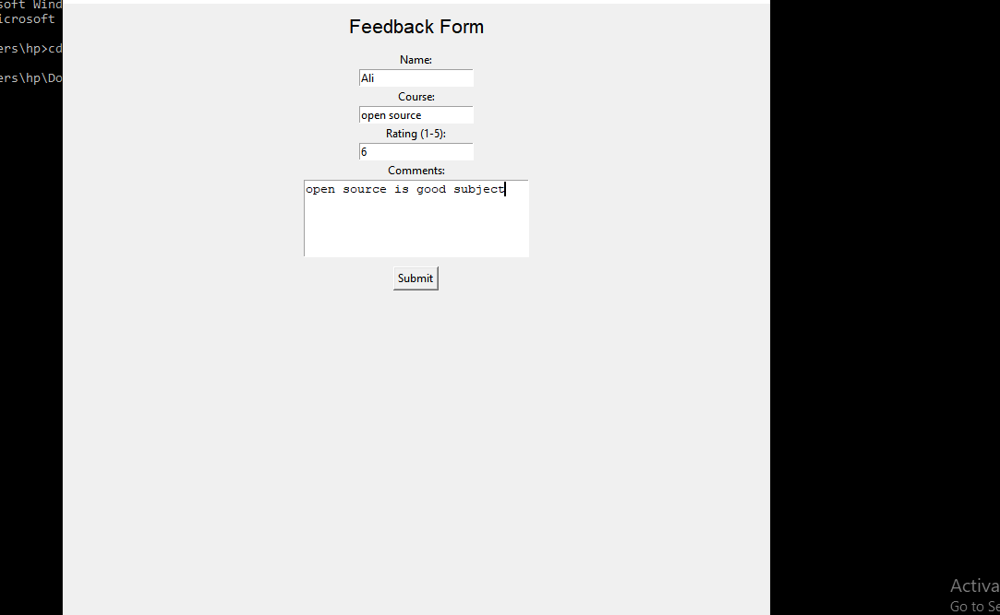

Student Feedback Form
Role of this Project:

The Student Feedback System was developed to provide a digital platform where students can easily give feedback on their courses, instructors, and overall academic experience. The main goal of the project was to simplify and digitize the manual feedback process typically done using paper forms. Through this system, feedback is securely stored in a database, which helps institutions analyze responses and make necessary improvements in teaching quality and course structure. The project ensures better transparency, faster data collection, and easy report generation for academic improvement.

Tools:
 Frontend: Tkinter (Python GUI library)
 Backend: Python
 Database: SQLite

Team Contributions:

Name	                 ID	                        Contribution
Ali hassan faiz	   F2023105239	             Designed the main page (home.py)
Arslan ahmad	     F2023105240                  He can do edit task (edit.py)
Babar	             F2023105216	                 Create the feedback page 
Usman ghani	       F2023105209	             He can do view page in which we can see
Khair ullah	       F2023105242	           He can do submit page in which we can submit feedback
--Pull Request Link:
https://github.com/malikbabar22/Student_feedbacck/pull/5
https://github.com/malikbabar22/Student_feedbacck/pull/4
https://github.com/malikbabar22/Student_feedbacck/pull/3
https://github.com/malikbabar22/Student_feedbacck/pull/2
https://github.com/malikbabar22/Student_feedbacck/pull/1
--InterFace Pic:

